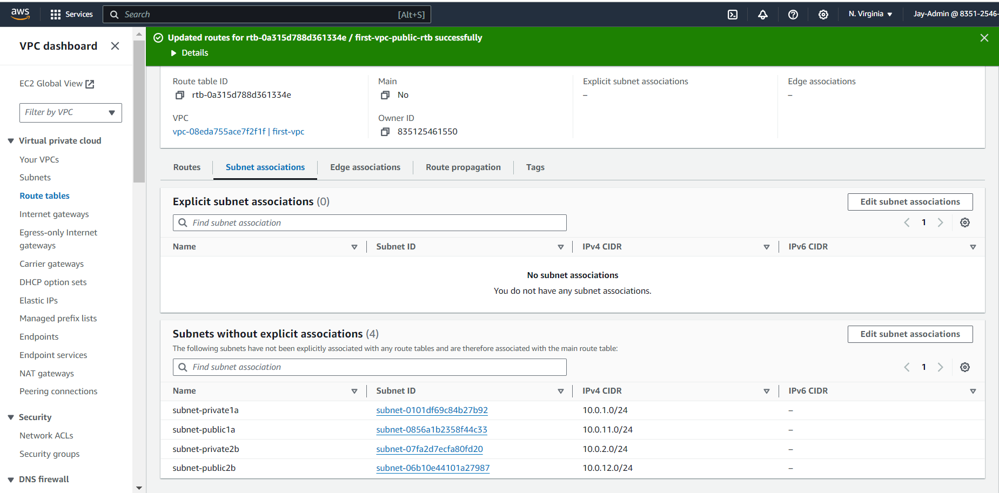

# AWS Networking Implementation (VPC, Subnets, IG, NAT, Routing)

# VPC Creation and Subnet Configuration

This field uses Virtual Private Clouds (VPCs) and subnets to create the backbone of your cloud-based projects. In this article, we will simplify the complex aspects of AWS networking, highlighting the useful and adaptable nature of VPCs and subnets, Whether you're an old AWS user or just starting, this guide will help you understand VPCs and subnets better. 

## What is an Amazon VPC?

An Amazon Virtual Private Cloud is like your own private section of the Amazon Cloud, where you can place and manage your resources (like servers and databases). You control who and what can go in and out, just like a gated community.

The essential steps to creating a VPC and configuring core network services. The topics covered are:

- The Default VPC

- Creating a new VPC

- Creating and configuring subnets

### The Default VPC

The default VPC is like a starter pack provided by Amazon for your cloud resources. It's a preconfigured space in the Amazon Cloud where you can immediately start deploying your applications or services. It has built-in security and network settings to help you get up and running quickly, but you can adjust these as you like.

### Creating a new VPC 

As we want to learn step by step and observe the components, choose the "VPC only" option, we'll use the "VPC and more" option later. Enter "first-vpc" as the name tag and "10.0.0.0/16" as the IPv4 CIDR. The 10.0.0.0/16 will be the primary IPv4 block and you can add a secondary IPv4 block e.g., 10.64.0.0/16. The use case of a secondary CIDR block could be because you're running out of IPs and need to add a block, or there's a VPC with overlapping CIDR that you need to peer or connect.

As soon as your VPC is created, it is assigned a vpc-id and there's a route table created that serves as the main route table

Now you have a VPC and a route table, but you won't be able to put anything inside. If you try to create an EC2 instance for example, you can't proceed as it requires subnets.

### Creating and configuring subnets

What are subnets?

Subnets are like small segments within a VPC that help you organize and manage your resources. Subnets are like dividing an office building into smaller sections, where each section represents a apartment. In this analogy, subnets are created to organize and manage the network effectively.

Subnetname           AZ       CIDR block

subnet-public1a   us-east-1a  10.0.11.0/24

subnet-public2b   us-east-1b  10.0.12.0/24

subnet-private1a  us-east-1a  10.0.1.0/24

subnet-private2b  us-east-1b  10.0.2.0/24

Go to VPC>Subnets>Create Subnets and select the VPC that you just created

Click on Create Subnet

Enter the subnet setting details.

Once done, you should see all the subnets you just created on the console. As of now, you can deploy EC2 instances into the VPC by selecting on of the subnets, but the public subnets don't have any internet access at this stage. When you select a public subnet>route, you'll see it uses the main route table and only has the local route, no default route for internet access

## Understanding Public and Private Subnets in AWS VPC

In the world of AWS VPC, think of subnets as individual plots in your land (VPC). Some of these plots (subnets) have direct road access (internet access) - these are public subnets. Others are more private, tucked away without direct road access - these are
private subnets.

Creating a Public Subnet

Creating a public subnet is like creating a plot of land with direct road (internet) access. Here's how you do it:

• Go to the AWS VPC page.

• Find 'Subnets', click on it, then click 'Create subnet:

• Give this new plot a name, select the big plot (VPC) you want to divide, and leave the IP settings as they are.

• Attach an Internet Gateway to this subnet to provide the road (internet) access.

• Update the route table associated with this subnet to allow traffic to flow to and from the internet.

Creating a Private Subnet

Creating a private subnet is like creating a secluded plot without direct road (internet) access. Here's how you do it:

• Go to the AWS VPC page

• Find 'Subnets', click on it, then click 'Create subnet: G* ive this new plot a name, select the big plot (VPC) you want to divide, and leave the IP settings as they are

• Don't attach an Internet Gateway to this subnet, keeping it secluded.

• The route table for this subnet doesn't allow direct traffic to and from the internet.

Working with Public and Private Subnets

Public subnets are great for resources that need to connect to the internet, like web servers. Private subnets are great for resources that you don't want to expose to the internet, like databases.

Understanding public and private subnets helps you to organize and protect your AWS resources better. Always remember, use public subnets for resources that need internet access and private subnets for resources that you want to keep private
Internet Gateway and Routing Table

## Introduction to Internet Gateway and Routing Table

Just like in a real city, in your virtual city (VPC), you need roads (Internet Gateway) for people (data) to come and go. And you also need a map or GPS (Routing Table) to tell people (data) which way to go to reach their destination.

What is an Internet Gateway?

An Internet Gateway in AWS is like a road that connects your city (VPC) to the outside world (the internet). Without this road, people (data) can't come in or go out of your city (VPC).|

Deep Dive into Internet Gateways

To give your public subnet access to the main road (internet), you need an Internet Gateway. This acts like the entrance and exit to your property. We'll show you how to create and attach an Internet Gateway to your VPC

Public Subnets

Technically, the subnets are still private. You'll need these to make it work as public subnets:

• An Internet Gateway (IGW) attached to the VPC

• Route table with default route towards the IGW

• Public IP assigned to the AWS resources (e.g., EC2 instances)

Go to VPC > Internet gateways and click "Create internet gateway"

Put a name tag and click internet gateway

Attach the IGW to the VPC you created

We want the private subnets to be private, we don't want the private subnets to have a default route to the Internet. For that, we'll need to create a separate route table for the public subnets.

### What is a Routing Table?

A Routing Table is like a map or GPS. It tells the people (data) in your city (VPC) which way to go to reach their destination. For example, if the data wants to go to the Internet, the Routing Table will tell it to take the road (Internet Gateway) that you built.

### Creating and Configuring Routing Tables

Now that we have our entrance and exit (Internet Gateway), we need to give directions to our resources. This is done through a Routing Table. It's like a map, guiding your resources on how to get in and out of your VPC.

Let's go to the route table menu and create a route table for the public subnets.

Put a name for the route table e.g. first-vpc-public-rtb and select the desired vpc - "first-vpc"

Once created, edit the route table, add a default route to the Internet Gateway

Select Internet Gateway

Go to the "subnet associations" and click "edit subnet associations"

Select the public subnets and click "save associations"

Now that the VPC is ready, you can run an EC2 instance in public subnets if they need internet access or in private subnets if they don't.

Note: 

first-vpc-public-rtb: A route table with a target to the Internet gateway is a public route table.

first-vpc-private-rtb: A route table with a target to NAT gateway is a private route table

- Also create the route table for the private but subnets and routes should not be attached yet

## NAT Gateway and Private Subnets

Introduction to Private Subnets and NAT Gateway

In your AWS Virtual Private Cloud (VPC), private subnets are secluded areas where you can place resources that should not be directly exposed to the internet. But what if these resources need to access the internet for updates or downloads? This is where
the NAT Gateway comes in.

A private subnet in AWS is like a secure room inside your house (VPC) with no windows or doors to the street (internet). Anything you place in this room (like a database) is not directly accessible from the outside world

### Understanding NAT Gateway

A Network Address Translation (NAT) Gateway acts like a secure door that only opens one way. It allows your resources inside the private subnet to access the Internet for things like updates and downloads, but it doesn't allow anything from the Internet to
enter your private subnet.

A Network Address Translation (NAT) allows instances in your private subnet to connect to outside services like Databases but restricts external services to connecting to these instances.

### Creating a NAT Gateway and Linking It to a Private Subnet

We'll guide you step-by-step on how to create a NAT Gateway and how to link it to your private subnet. We'll also cover how to configure a route in your routing table to direct outbound internet traffic from your private subnet to the NAT Gateway.

Go to VPC > NAT Gateways and click "Create NAT Gateway"|

You need to allocate Elastic IP because it is required for the creation of NAT gateway

Let's go to the route table menu and create a route table for the private subnets

edit the route table and add a default route to the NAT gateway

