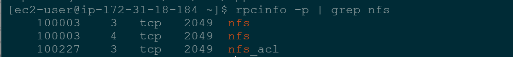
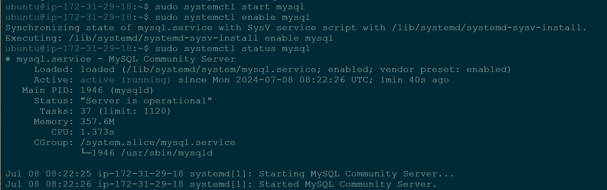

# DevOps Tooling Website Solution 

In the previous project, we Implemented a WordPress-based solution that is ready to be filled with content and can be used as a full-fledged website or blog. Moving further we will add more value to our solutions that a DevOps team could utilize. We want to introduce a set of DevOps tools that will help our team manage, develop, test, deploy, and monitor different projects.

The tools we want our team to be able to use are well-known and widely used by multiple DevOps teams, so we will introduce a single DevOps Tooling Solution that will consist of: 

1. Jenkins - free and open source automation server used to build CI/CD pipelines.

2. Kubernetes - an open-source container-orchestration system for automating computer application deployment, scaling, and management.

3. Jfrog Artifactory- Universal Repository Manager supporting all major packaging formats, build tools, and CI servers Artifactory.

4. Rancher - an open-source software platform that enables organizations to run and manage Docker and Kubernetes in production.

5. Grafana - A multi-platform open-source analytics and interactive visualization web application.

6. Prometheus - an open-source monitoring system with a dimensional data model, flexible query language, efficient time series database, and modern alerting approach.

7. Kibana - a free and open-source user interface that lets you visualize your Elasticsearch data and navigate Elastic Stach.
  
## Setup and Technologies used in this Project

As a member of a DevOps team, I will implement a tooling website solution that makes access to DevOps tools within the corporate infrastructure easily accessible. 

In this project, I will implement a solution that consists of the following components:

1. Infrastructure: AWSk

2. Webserver Linux: Red Hat Enterprise Linux 9

3. Database Server: Ubuntu 22.04 + MySQL

4.  Storage Server: Red Hat Enterprise Linux 9 + NFS Server

5.  Programming Language: PHP

6.  Code Repository: GitHub

For RHEL 9 server use this ami 


In the diagram below, you can see a common pattern where several stateless Web Servers share a common database and access the same files using Network File System (NFS) as a shared file storage though the NFS server might be located on completely separate hardware. For Web Servers, it looks like a local file system from where they can serve the same files.


It is important to know what storage solution is suitable for what use cases, for this you need to answer the following questions: what data will be stored, in what format, how will this data be accessed, by whom, from where, how frequently, etc. Based on this you can choose the right storage system for your solution.

# Implementing a business website using NFS for the backend file storage

### Step 1: Prepare NFS Server

1. Spin up a new EC2 instance with RHEL Linux 9 Operating system.

2. Based on your LVM experience, Configure LVM on the Server.

   - Instead of formatting the disks as ext4, format them as xfs
  
   - Ensure there are 3 Logical Volumes. lv-opt, lv-apps, and lv-logs
  
   - Create mount points on /mnt directory for the logical volumes as follows: Mount lv-apps on /mnt/apps - To be used by webservers, Mount lv-logs on /mnt/logs - To be used       by webservers logs, Mount lv-opt on /mnt/opt - To be used by Jenkins server in the next Project.
  
3. Install NFS server, configure it to start on reboot, and make sure it is up and running

```
sudo yum -y update
sudo yum install nfs-utils -y
sudo systemctl start nfs-server.service
sudo systemctl enable nfs-server.service
sudo systemctl status nfs-server.service
```

4.  Export the mounts for the webservers' subnet cidr to connect as clients. For simplicity, you will install all three Web Severs inside the same subnet, but in production, you would probably want to separate each tier inside its subnet for a higher level of security. to check your subnet cidr - open your EC2 details in the AWS web console and locate Networking tab and open a Subnet link:


Set up permissions to allow or web servers read, write and execute files on NFS:

```
sudo chown -R nobody: /mnt/apps
sudo chown -R nobody: /mnt/logs
sudo chown -R nobody: /mnt/opt

sudo chmod -R 777 /mnt/apps
sudo chmod -R 777 /mnt/logs
sudo chmod -R 777 /mnt/opt

sudo systemctl restart nfs-server.service
```


Configure access to NFS for clients within the same subnet 

`sudo vi /etc/exports`

then edit file by adding 

```
/mnt/apps <Subnet-CIDR>(rw,sync,no_all_squash,no_root_squash)
/mnt/logs <Subnet-CIDR>(rw,sync,no_all_squash,no_root_squash)
/mnt/opt <Subnet-CIDR>(rw,sync,no_all_squash,no_root_squash)
```

Esc then :wq!


`sudo exportfs -arv`


5.  Check which port is used by NFS and open it using Security groups (add new inbound rule)

`rpcinfo -p | grep nfs`



Important note: For NFS server to be accessible from your client, you must also open the following ports: TCP 111, UDP 111, and UDP 2049.


## Configure backend database as part of 3 tier architecture

### Step 2: Configure the Database server

1. Install MySQL server

`sudo apt -y install mysql-server`




2. Create a database and name it tooling

3. Create a database user and name it webaccess

4. Grant permission to webaccess user on tooling database to do anything only from the webservers subnet cidr


### Step 3: Prepare the Web Servers

We need to make sure that our Web servers can serve the same content from the shared storage solutions, in our case - NFS Server and MySQL database. You  already know that one DB can be accessed for reads and writes by multiple clients. for storing shared files that our Web servers will use - we utilize NFS and mount previously created Logical volumes lv-apps to the folder where Apache stores files to be served to the users (/var/www).

This approach will make our Web servers stateless, which means we will be able to add new ones or remove them whenever we need, and the integrity of the data (in the database and on NFS) will be preserved.

During the next steps, we will do the following:

- Configure NFS client (this step must be done on all three servers)

- Deploy a Tooling application on our Web servers into a shared NFS folder

- Configure the Web Servers to work with a single MySQL database

1. Launch a new EC2 instance with RHEL 9 Operating system

2. Install NFS client

`sudo yum install nfs-utils nfs4-acl-tools -y

3. Mount /var/www/ and target the NFS server's export for apps

```
sudo mkdir /var/www
sudo mount -t nfs -o rw,nosuid <NFS-Server-Private-IP-Address>:/mnt/apps /var/www
```

4. Verify that NFS was mounted successfully by running `df -h`. Make sure the changes will persist on Web server after reboot:

`sudo vi /etc/fstab`

add the following line

`<NFS-Server-Private-IP-Address>:/mnt/apps /var/www nfs defaults 0 0`

5. Install Remi's repository, Apache and PHP
```
sudo yum install httpd -y

sudo dnf install https://dl.fedoraproject.org/pub/epel/epel-release-latest-8.noarch.rpm

sudo dnf install dnf-utils http://rpms.remirepo.net/enterprise/remi-release-8.rpm

sudo dnf module reset php

sudo dnf module enable php:remi-7.4

sudo dnf install php php-opcache php-gd php-curl php-mysqlnd

sudo systemctl start php-fpm

sudo systemctl enable php-fpm

setsebool -P httpd_execmem 1
```

Repeat steps 1-5 for 2 more web servers.

6. Verify that Apache files and directories are available on the Web server in /var/www and also on the NFS server in /mnt/apps. If you see the same files it means that NFS is mounted correctly. You can try to create a new file `touch test.txt` from one server and check if the same file is accessible from the other web servers.

7. Locate the log file for Apache on the wev server and mount it to NFS server's export for logs. Repeat step No 4 to make sure the mount point will persist after reboot.

8. fork the tooling source code from Darey.io Github Account to your Github account.

9. Deploy the tooling website's code to the Web server. Ensure that the html folder from the repository is deployed to /var/www/html

Note 1: do not forget to open TCP port 80 on the web servers

Note 2: If you encounter 403 Error - check permissions on your /var/www/html folder and also disable SELinuz `sudo setenforce 0`, To make this change permanent - open following config file `sudo vi /etc/sysconfig/selinux` and set SELINUX=disabled, then restart httpd


10. Update the website's configuration to connect to the database (in /var/www/html/functions.php file). Apply tooling-db.sql script to your database using the command: `mysql -h` <database-private-ip> -u <db-username> -p <db-password> <tooling-db.sql`


11. create a new admin by applying tooling-db.sql script from (tooling-repo directory) to your database using the command:

`mysql -h <databse-private-ip> -u <db-username> -p <database> < tooling-db.sql`


To check for the created admin in the database we run the commands

```
$ sudo mysql -p

mysql> use tooling;

mysql> show tables;

mysql> select from * users;
```


12. Open the website in your browser HTTP;//<web-server-public-IP-address-or-Public-DNS-Name>/index.php and make sure you can login into the website with myuser user.


  


