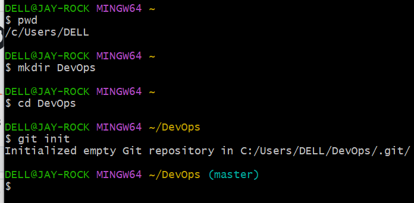
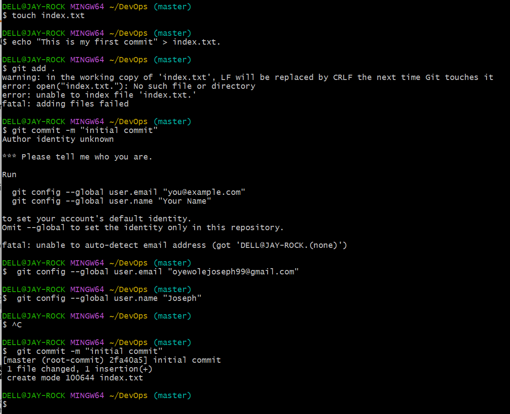
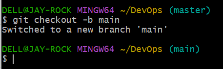
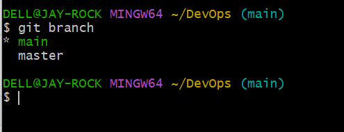
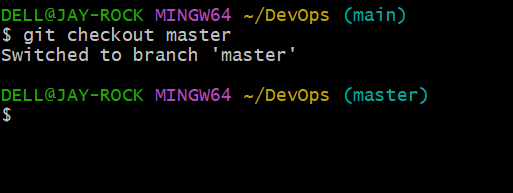

## Initializing a Repository and Making Commits

### Initializing a Repository and Making Commits

Before diving into our main objective which is initializing sit and making commits, lets start by introducing Git.

### What is Git

Git is a distributed version control system. This is a typical definition you will find on the internet. But lets break it down further. Git essentially solves the problem of sharing source code efficiently and keeping track of changes made to source code.

Before Git, there were other technologies available that solves this problem a good example is SVN.

The way that SVN solved this problem posed some challenges. In SVN there exist a central source code repository. Every change by developers is made against this central repository. This setup makes it difficult for developers to collaborate because changes can only be made one at time. Secondly if for any reason the central server goes down or is not reacheable that effectively blocks the
developers.

Git adopted a different approach. It allows developers make their own copy of the central repository. That is why it is referred to as a Distributed Version Control System.

### Initializing a Git Repository

Before initializing a git repo you must have installed git in your computer.

Click on this Install Git. Choose your operating system, could be windows, mac, or even linux. Download and install git in your computer.

Now to initialize a git repo follow these steps:

- Open a terminal on your computer, eg git bash,

- On your terminal create your working folder or directory eg DevOps folder using this command mkdir DevOps

- Change or move into your working directory or folder using this command cd DevOps

- While you are inside the folder, run git init command

### Making your first Commit

In the last section, we successfully created our working directory and initialized a git repository. Now we will make our first commit.

Before making our first commit let's try to understand what a commit is in git. A Commit is more or less saving the changes you made to your files. Changes can be adding, modifying, or deleting files or text.

When you make a commit, git takes a snapshot of the current state of your repository and saves a copy in the git folder inside your working directory.

Now let's make our first commit by following these steps:
- Inside your working directory create a file index. txt using this command touch indextext.

- Write any sentence of your choice inside the text file, Afterwards, save your changes.

- Add your changes to git staging area using this command git add

- To commit your changes to git, run the command git commnit -m "initial commot"

The -m flag is used to provide a commit message. The commit message is a nice way to provide context about the commit. When writing a commit message, make it descriptive as possible. Let it explain why the commit was made.

## Working with Branches

### Working with Branches

Imagine you have a notebook and you want to write different stories on different pages of your notebook so that you do not mess up your previous note.

git branch helps you create a different copy(page) of your source code. In your new branch you can make changes as you please. Your change is independent of what is available in the main copy.

Git branch is commonly used to develop new features of your application. You will agree with me that the initial code is untested and as such can not be added to the code base of your live application.

Git branch is also an important tool for collaboration within remote teams(developers working from different locations). They can make separate branches while working on the same feature. And at the end of the day, converge their code to one branch.

### Make you first git Branch
To make a new branch run this command: git checkout -b

The -b flag helps you create and change into the new branch 

With that said let's make our first branch following these steps:
- Having made your first commit in the previous lesson

- Make a new branch by running this command git checkout -b my new branch

### Listing your git Branches

Use the command below to list the branches on your local git repository

git branch

### Change into an Old Branch

To change into an exiting or old branch use the command below:

git checkout ‹ branch-name›

### Merging a Branch into another Branch

Let's say we have two branches A and B. And we want to add the content of branch B into A.

First, we change into branch A and run the git command below:

git merge B

### Deleting a git branch

When a new feature is added to an application, It's often done in a feature branch. Usually, this feature branch is deleted when the code must have been tested and merged into a staging or dev environment depending on the branch strategy of the team.

The Git branch can be deleted with the command below:

git branch -d <branch-name>

This is not all you can do with branches in Git. To learn more type the command Bit branch --help on your terminal.

## Collaboration and Remote Repositories

### Collaboration and Remote Repositories

Lets take a moment to recap about wharve have learnt so far. We learnt that git is a distributed version control system. That essentially solves the problem sharing source code and tracking changes made to source code.

We then learnt about some operations like initializing git repository in our local machine, creating commit, branches etc.

We also mentioned in passing that git is used for collaboration among remote teams(developers residing in different location). But come to think of it how can developers working remotely collaborate(making changes, adding, updating etc) on the same code base since we currently have our code in our local computer.

This where github comes in. Github is a web based platform where git repositores are hosted. By hosting our local git repository on github, it becomes available in the public internet(it is possible to create private repository as well). Anyone can now access it,

Remote teams can now view, update, and make changes to the same repository.

### Creating a Github Account

step 1: Head to join sithub.com

step 2: Enter your username, password, and email

step 3: Click on the "verify" button to verify your identity

step 4: Click on the "Create account" button to create your account

step 5: An activation code will be sent to your email, enter the code in the text boxes provided then click "Continue"

step 6: A list of github plans will be shown to you. Click "Continue for free"

### Creating your first repository

step 1: Click on the + sign at the top right corner of your github account. A drop down menu will appear, select new repository

step 2: fill out the form by adding a unique repository name, and description and ticking the box to add a Readme.md file

step 3: Click the "Create repository button" to create your repository.

### Pushing your Local git Repository to your Remote github Repository.

Having created a github account and a github repository in earlier steps. Let's send a copy of our story to our repository in github.

We will achieve this by following the steps below:
- Add a remote repository to the local repository using the command below:

git remote add origin <link to your github repo>

The word origin refers to your remote repo link, it evaluates to the remote repo url. It can be any word you choose.
Cloning Remote Git Repository
In the last Lesson, We successfully added a remote git repository and pushed our story in the local repository. Now our friend can now make contributions to our story.
Give it a thought, will he be working on our story on github directly on make a local copy?
Best practice dictates that he makes a copy of our story locally in his local machine, creates a branch where he can make all the modifications he sees fit.
But how is he going to make a local copy of our story in his loaci machine? Git clone command to the rescue.
The git clone command helps us make a copy of remote repository in our local machine. See it as a git tool for downloading remote repository into our local machine. The command is as follows:
Copy Below
Tle
git cLone Kiink to youn nenore reposatory！

Branch Management and Tagging
Introduction to Markdown Syntax
Markdown syntax is a lightweight markup language that is widely used for formatting plain text, it allows you to add formatting elements to your text without using complex HTML or other formatting languages. Markdown is commonly used for creating documents, README files, forum posts, and even web pages.

Here is the most commonly used markdown syntax elements:
1. Headings: To create heading, use the hash symbol at the beginning of the line. The number of hash symbol used indicate the level of the heading.
Copy Below Code
# Heading 1
## weading 2
#I# Heading 3
2. Emphasis: asterisks or underscore is used to Emphasis text
Copy Below Code
Phtalie* on_italic_
mboldsx on bolo_
3. Lists: markdown has support for both ordered and unorderd list

unordered list example:
Copy Below Code
Iten I
- Item 2
n Item 3
ordered list example:
Copy Below Code
--FErst 2tem
Second iter
Third item
4. Links:: To create a hyperlink use square brackets for the link text followed by parentheses containing the URL.
example:
Copy Below Code
Wvisit darey-solChttps-//ar.caney.tol
5. Images: To display an image, use an exclamation mark followed by square brackets for the alt text and parentheses containing the image URL.
