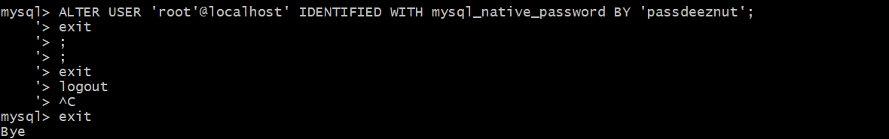
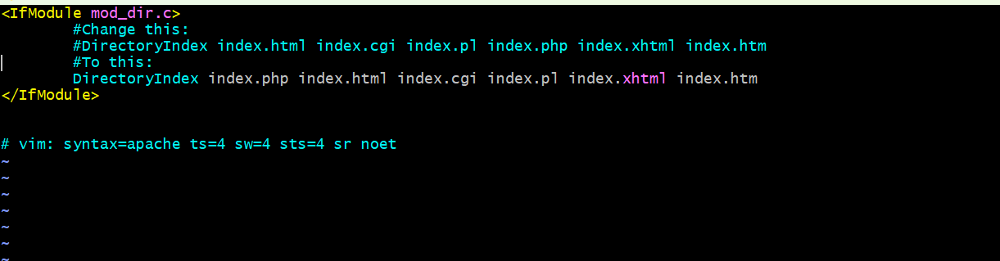

# Lamp Stack Implementation

The Project (LAMP Stack) is a comprehensive program designed for individuals seeking to build and deploy web applications using the LAMP stack. This course offers a hands-on learning experience, guiding participants through the process of creating dynamic websites by combining Linux, Apache, MySQL, and PHP. Throughout the course and project implementation, participants will gain a solid understanding of the LAMP stack components and their roles in web application development. Starting with an introduction to the LAMP stack architecture, learners will explore the benefits and advantages of using this powerful combination of technologies.

The course/project covers essential topics such as setting up a Linux environment, configuring the Apache web server, managing MySQL databases, and writing PHP code for server-side functionality. Participants will learn how to install and configure the necessary software components, ensuring a smooth and optimized development environment. By following the practical examples, and demo shown, and engaging in hands-on exercises, participants will gain proficiency in building dynamic web applications. They will learn how to handle user requests, interact with databases, process forms, and implement security measures. Additionally, the course/project will cover common development frameworks and tools that can enhance productivity and simplify web application development.

The Project (LAMP Stack) goes beyond the basics, delving into advanced topics such as performance optimization, debugging, and deployment strategies. Participants will gain insights into best practices for scaling applications, securing data, and ensuring the robustness of their projects. Upon completion of the course/project, participants will have acquired the skills and knowledge required to develop and deploy web applications using the LAMP stack. Whether pursuing personal projects or working in a professional setting, this project will equip you with the expertise to leverage the power of the LAMP stack and build robust, scalable, and secure web applications.

# Web Stack Implementation (Lamp Stack) in AWS

## What is a Technology stack?

A technology stack is a set of frameworks and tools used to develop a software product. This set of frameworks and tools are very specifically chosen to work together in creating well-functioning software. They are acronyms for individual technologies used together for a specific technology product. some examples are...

-LAMP (Linux, Apache, MySQL, PHP, Python, or Perl)

-LEMP (Linux, Nginx, MySQL, PHP, Python, or Perl) 

-MERN (MongoDB, Express JS, React.JS, NodeJS)

-MEAN (MongoDB, Express.JS, Angular JS, NodeJS

## Preparing prerequisites

### Step 0 - Preparing prerequisites

To complete this project you will need an AWS account and a virtual server with Ubuntu Server OS.

AWS is the biggest Cloud Service Provider and it offers a free tier account that we are going to leverage for our projects.

AWS can provide us with a free virtual server called EC2 (Elastic Compute Cloud) for our needs.

### (Windows) - Connecting to EC2 using Putty.

Remember the private key you downloaded from AWS while provisioning the server? It is a PEM file format. You can open it up to see the content and have a glimpse of what a PEM file looks like.

Now, we are going to use that PEM key to connect to our EC2 instance via ssh.

• Connect to the instance by running

`ssh -i "Projectkey.pem" ubuntu@ec2-3-86-205-228.compute-1.amazonaws.com`

Follow the instructions below to get some work done Installing Apache and Updating the Firewall

### Step 1 - Installing Apache and Updating the Firewall

What exactly is Apache?

Apache HTTP Server is the most widely used web server software. Developed and maintained by Apache Software Foundation, Apache is an open-source software available for free. It runs on 67% of all web servers in the world. It is fast, reliable, and secure. It can be highly customized to meet the needs of many different environments by using extensions and modules. Most WordPress hosting
providers use Apache as their web server software. However, websites and other applications can run on other web server software as well. Such as Nginx, Microsoft's IIS, etc.

The Apache web server is among the most popular web servers in the world. It's well documented, has an active community of users, and has been in wide use for much of the history of the web, which
makes it a great default choice for hosting a website.

Install Apache using Ubuntu's package manager 'apt':

Update a list of packages in the package manager

`sudo apt update`

Run Apache2 package installation

`sudo apt install apache2`

To verify that apache2 is running as a Service in our OS, use the following command

`sudo systemctl status apache2`

If it is green and running, then you did everything correctly - you have just launched your first Web Server in the Clouds!
Before we can receive any traffic from our Web Server, we need to open TCP port 80 which is the default port that web browsers use to access web pages on the Internet

As we know, we have TCP port 22 open by default on our EC2 machine to access it via SSH, so we need to add a rule to EC2 configuration to open an inbound connection through port 80:

Our server is running and we can access it locally and from the Internet (Source 0.0.0.0/0 means 'from any IP address').

First, let us try to check how we can access it locally in our Ubuntu shell, run:

`curl http://localhost: 80`

or

`curl http://3.86.205.228:80`

These 2 commands above actually do pretty much the same - they use the 'curl' command to request our Apache HTTP Server on port 80 (actually you can even try to not specify any port - it will work
anyway). The difference is that: in the first case we try to access our server via DNS name and in the second one - by IP address (in this case IP address 3.86.205.228 corresponds to DNS name 'localhost'
and the process of converting a DNS name to an IP address is called "resolution"). We will touch on DNS in further lectures and projects.

As an output you can see some strangely formatted tests, do not worry, we just made sure that our Apache web service responds to the 'curl' command with some payload.

Now it is time for us to test how our Apache HTTP server can respond to requests from the Internet. Open a web browser of your choice and try to access the following URL

`http://3.86.205.228:80`

Another way to retrieve your Public IP address, other than to check it in the AWS Web console, is to use the following command:

`curl -s http://169.254.169.254/latest/meta-data/public-ipv4`

The URL in the browser shall also work if you do not specify a port number since all web browsers use port 80 by default.

If you see the following page, then your web server is now correctly installed and accessible through your firewall.

It is the same content that you previously got by the 'curl' command but represented in the nice HTML formatting by your web browser.

## Installing Mysql

### Step 2 - Installing MySQL

Now that you have a web server up and running, you need to install a Database Management System (DBMS) to be able to store and manage data for your site in a relational database. MySQL is a popular relational database management system used within PHP environments, so we will use it in our project.

Again, use 'apt' to acquire and install this software:

`sudo apt install mysql-server`

When prompted, confirm installation by typing y, and then ENTER

When the installation is finished, log in to the MySOL console by typing:

`sudo mysql`

This will connect to the MySQL server as the administrative database user root, which is inferred by the use of sudo when running this command. 

You should see output like this:

It's recommended that you run a security script that comes pre-installed with MySQL. This script will remove some insecure default settings and lock down access to your database system. Before running the script you will set a password for the root user, using mysal_native_password as the default authentication method. We're defining this user's password as Passdeeznut.

ALTER USER 'root '@'localhost' IDENTIFIED WITH mysql_native_password BY 'Passdeeznut';

Exit the MySQL shell with:

mysql› `exit`

Start the interactive script by running:

`sudo mysql_secure_installation`

This will ask if you want to configure the VALIDATE PASSWORD PLUGIN.

Note: Enabling this feature is something of a judgment call. If enabled, passwords which don't match the specified criteria will be rejected by MySQL with an error. It is safe to leave validation disabled, but you should always use strong, unique passwords for database credentials.

Answer y for yes, or anything else to continue without enabling.

Regardless of whether you chose to set up the VALIDATE PASSWORD PLUGIN , your server will next ask you to select and confirm a password for the MySQL root user. This is not to be confused with the system root. The database root user is an administrative user with full privileges over the database system. Even though the default authentication method for the MySQL root user dispenses the use
of a password, even when one is set, you should define a strong password here as an additional safety measure. We'll talk about this in a moment.

If you enabled password validation, you'll be shown the password strength for the root password you just entered and your server will ask if you want to continue with that password. If you are happy with your current password, enter y for "yes" at the prompt:

For the rest of the questions, press and hit the ENTER key at each prompt. This will prompt you to change the root password, remove some anonymous users and the test database, disable remote root logins, and load these new rules so that MySQL immediately respects the changes you have made.

When you're finished, test if you're able to log in to the MySQL console by typing:

`sudo mysql -p`

Notice the -p flag in this command, which will prompt you for the password used after changing the root user password.

To exit the MySQL console, type:

mysql> `exit`

Notice that you need to provide a password to connect as the root user.

For increased security, it's best to have dedicated user accounts with less expansive privileges set up for every database, especially if you plan on having multiple databases hosted on your server.

Note: At the time of this writing, the native MySQL PHP library mysqlnd doesn't support caching sha2_authentication, the default authentication method for MySQL 8. For that reason, when creating database users for PHP applications on MySQL 8, you'll need to make sure they're configured to use mysql_native_password instead.

Your MySQL server is now installed and secured. Next, we will install PHP, the final component in the LAMP stack.

## Installing PHP

### Step 3 - Installing PHP

You have Apache installed to serve your content and MySQL installed to store and manage your data. PHP is the component of our setup that will process code to display dynamic content to the end user. In addition to the php package, you'll need php-mysql, a PHP module that allows PHP to communicate with MySQL-based databases. You'll also need libapache2-mod-php to enable Apache to handle PHP files. Core PHP packages will automatically be installed as dependencies.

To install these 3 packages at once, run:

`sudo apt install php libapache2-mod-php php-mysql`

Once the installation is finished, you can run the following command to confirm your PHP version:

`php -v`

At this point, your LAMP stack is completely installed and fully operational.

-Linux (Ubuntu)

-Apache HTTP Server

-MySOL

-PHP

To test your setup with a PHP script, it's best to set up a proper Apache Virtual Host to hold your website's files and folders. Virtual host allows you to have multiple websites located on a single
machine and users of the websites will not even notice it.

## Enable PHP on the website

### Step 4 - Creating a Virtual Host for your Website using Apache

In this project, you will set up a domain called projectlamp, but you can replace this with any domain of your choice.

Apache on Ubuntu 20.04 has one server block enabled by default that is configured to serve documents from the /var/www/html directory. We will leave this configuration as is and will add our directory next to the default one.

Create the directory for project Lamp using 'mkdir' command as follows:

`sudo mkdir /var/www/projectlamp`

Next, assign ownership of the directory with the SUSER environment variable, which will reference your current system user:

`sudo chown -R SUSER:SUSER /var/ww/projectlamp`

Then, create and open a new configuration file in Apache's sites-available directory using your preferred command-line editor. Here, we'll be using vi or vim (They are the same by the way):

`sudo vi /etc/apache2/sites-available/projectlamp.conf`

This will create a new blank file. Paste in the following bare-bones configuration by hitting on i on the keyboard to enter the insert mode, and paste the text:

`‹VirtualHost *:80>`
      
      ServerName projectlamp
      
      ServerAlias www.projectlamp
      
      ServerAdmin webmaster@localhost
      
      DocumentRoot /var/ww/projectlamp
      
      Errorlog ${APACHE LOG DIR}/error.log
      
      CustomLog ${APACHE_LOG_DIR)/access. log combined

`</VirtualHost>`

To save and close the file, simply follow the steps below:

1. Hit the esc button on the keyboard

2. Type :

3. Type wq .w for write and q for quit

Hit ENTER to save the file

You can use the ls command to show the new file in the sites-available directory

`sudo 1s /etc/apache2/sites-available`

You will see something like this

`000-default.conf default-ssl.conf projectlamp.conf`

With this VirtualHost configuration, we're telling Apache to serve projectlamp using /var/www/projectlampl as its web root directory. If you would like to test Apache without a domain name, you can remove or comment out the options ServerName and ServerAlias by adding a # character at the beginning of each option's lines. Adding the # character there will tell the program to skip processing the instructions on those lines.

You can now use a2ensite command to enable the new virtual host:

`sudo alensite projectlamp`

You might want to disable the default website that comes installed with Apache. This is required if you're not using a custom domain name because in this case, Apache's default configuration would overwrite your virtual host. To disable Apache's default website use adissite command, and type:

`sudo a2dissite 000-default`

To make sure your configuration file doesn't contain syntax errors, run:

`sudo apache2ctl configtest`

Finally, reload Apache so these changes take effect:

`sudo systemctl reload apache2`

Your new website is now active, but the web root /var/www/projectlamp is still empty. Create an index.html file in that location so that we can test that the virtual host works as expected:

`sudo echo 'Hello LAMP from hostname' $(curl -s http://169.254.169.254/latest/meta-data/public-hostname) 'with public IP' $(curl -s http://169.254.169.254/latest/meta-data/public-ipv4) > /var/www/projectlamp/index.html`

Now go to your browser and try to open your website URL using the IP address:

`http://3.86.205.228`

If you see the text from 'echo' command you wrote to index.html file, then it means your Apache virtual host is working as expected. In the output, you will see your server's public hostname (DNS name) and public IP address. You can also access your website in your browser by public DNS name, not only by IP - try it out, the result must be the same (port is optional)

`http://3.86.205.228: 80/`

You can leave this file in place as a temporary landing page for your application until you set up an index. php file to replace it. Once you do that, remember to remove or rename the from your document root, as it would take precedence over an index.php file by default.
index.html file

## Creating a Virtual Host for your Website using Apache

### Step 5 - Enable PHP on the website

With the default DirectoryIndex settings on Apache, a file named index.html will always take precedence over an index.php file. This is useful for setting up maintenance pages in PHP applications, by creating a temporary index.html file containing an informative message to visitors. Because this page will take precedence over the index. php page, it will then become the landing page for the application. Once maintenance is over, the index.html is renamed or removed from the document root, bringing back the regular application page.

In case you want to change this behavior, you'll need to edit the /etc/apache2/mods-enabled/dir.conf file and change the order in which the index.php file is listed within the Directoryindex directive:

sudo vim /etc/apache2/mods-enabled/dir.conf

`‹IfModule mod_dir.c›`

    #Change this:

    #DirectoryIndex index.html index.cgi index.pl index.php index.xhtml index.htm

    #To this:

    #DirectoryIndex index.php index.html index.cgi index.pl index.html index.htm

    `</IfModule>`

After saving and closing the file, you will need to reload Apache so the changes take effect:

`sudo systemctl reload apache2`

Finally, we will create a PHP script to test that PHP is correctly installed and configured on your server.

Now that you have a custom location to host your website's files and folders, we'll create a PHP test script to confirm that Apache can handle and process requests for PHP files.

Create a new file named index.php inside your custom web root folder:

`vim /var/www/projectlamp/index.php`

This will open a blank file. Add the following text, which is valid PHP code, inside the file:

`< ?php
phpinfo();`

When you are finished, save and close the file, refresh the page and you will see a page similar to this:

This page provides information about your server from the perspective of PHP. It is useful for debugging and to ensure that your settings are being applied correctly.

If you can see this page in your browser, then your PHP installation is working as expected.

After checking the relevant information about your PHP server through that page, it's best to remove the file you created as it contains sensitive information about your PHP environment -and your Ubuntu server. You can use rm to do so:

`sudo rm /var/www/projectlamp/index.php`
