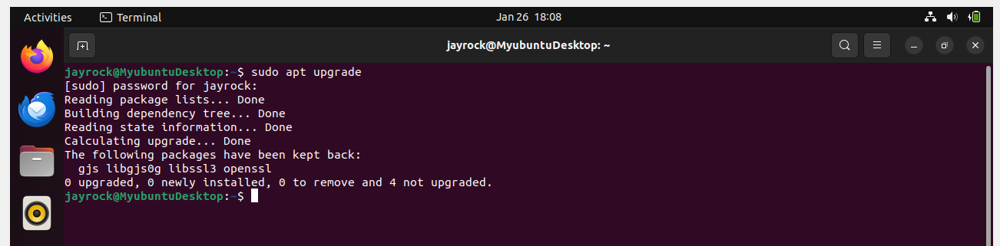
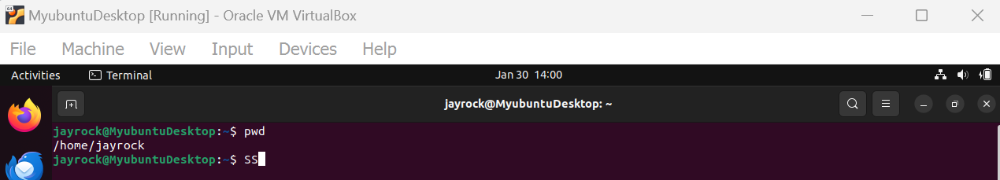

# This is my Linux project

## File Manipulation

### 1. Sudo Command
Sudo is short for superuser do, this is one of the most popular basic Linux commands that lets you perform tasks that require administrative or root permission. 

when using sudo, the system will prompt users to authenticate themselves with a password. Then, the Linux system will log a timestamp as a tracker. By default, every root user can run sudo commands for a 15-minute session. 

If you try to run sudo in the command line without authenticating yourself, the system will log the activity as a security event.

Here is a general syntax:

sudo (command e.g apt upgrade)

You can also add options such as:

-k or -reset = timestamp invalidates the timestamp file

-g or -group = group runs command as a specified group name or ID

-h or -host = host runs commands on the host

### 2. Pwd Command: 

Use the pwd command to find the path of your current/present working directory. Simply entering pwd will return the full current path- a path of all the directories that starts with a foward slash(/). For example, /home/ubuntu.

The pwd command uses the following syntax:

pwd (options)

It has two acceptable options: 

-L or logical prints environment variable content, including symbolic links.

-P or physical prints the actual path of the current directory.

pwd

