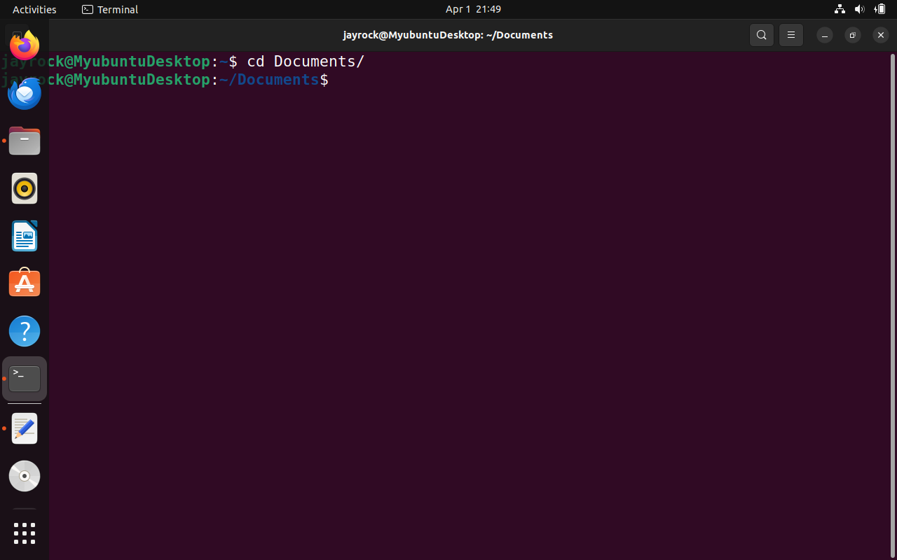
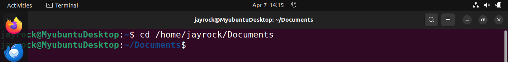
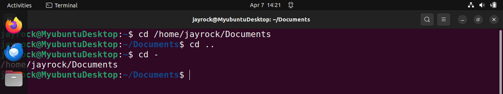

# This is my Linux project

## File Manipulation

### 1. Sudo Command
Sudo is short for superuser do, this is one of the most popular basic Linux commands that lets you perform tasks that require administrative or root permission. 

when using sudo, the system will prompt users to authenticate themselves with a password. Then, the Linux system will log a timestamp as a tracker. By default, every root user can run sudo commands for a 15-minute session. 

If you try to run sudo in the command line without authenticating yourself, the system will log the activity as a security event.

Here is a general syntax:

sudo (command e.g apt upgrade)

You can also add options such as:

-k or -reset = timestamp invalidates the timestamp file

-g or -group = group runs command as a specified group name or ID

-h or -host = host runs commands on the host

### 2. Pwd Command: 

Use the pwd command to find the path of your current/present working directory. Simply entering pwd will return the full current path- a path of all the directories that starts with a forward slash(/). For example, /home/ubuntu.

The pwd command uses the following syntax:

pwd (options)

It has two acceptable options: 

-L or logical prints environment variable content, including symbolic links.

-P or physical prints the actual path of the current directory.

pwd

### 2. cd command:

To navigate through the Linux files and directories, use the cd command. Depending on your current working directory, it requires either the full path or the directory name.

Running this command without an option will take you to the home folder. Keep in mind that only users with sudo privileges can execute it. 

Let's say you're in /home/jayrock and want to go to a new subdirectory of jayrock. To do so, enter the following command:

cd Documents

If you want to switch to a completely new directory, for example,/home/jayrock/Documents, you have to enter cd followed by the directory's absolute path:

cd /home/jayrock/Documents

Here are some shortcuts to help you navigate:

cd ~[username] goes to another user's home directory.

cd.. moves one directory up

cd- moves to your previous directory.

