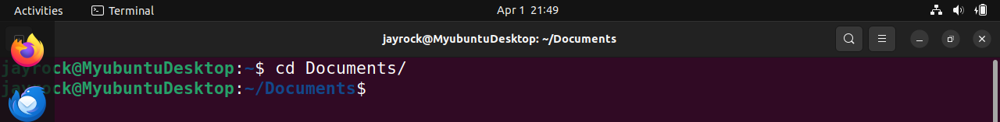

# This is my Linux project

## File Manipulation

### 1. Sudo Command
Sudo is short for superuser do, this is one of the most popular basic Linux commands that lets you perform tasks that require administrative or root permission. 

when using sudo, the system will prompt users to authenticate themselves with a password. Then, the Linux system will log a timestamp as a tracker. By default, every root user can run sudo commands for a 15-minute session. 

If you try to run sudo in the command line without authenticating yourself, the system will log the activity as a security event.

Here is a general syntax:

sudo (command e.g apt upgrade)

You can also add options such as:

-k or -reset = timestamp invalidates the timestamp file

-g or -group = group runs command as a specified group name or ID

-h or -host = host runs commands on the host

### 2. Pwd Command: 

Use the pwd command to find the path of your current/present working directory. Simply entering pwd will return the full current path- a path of all the directories that starts with a forward slash(/). For example, /home/ubuntu.

The pwd command uses the following syntax:

pwd (options)

It has two acceptable options: 

-L or logical prints environment variable content, including symbolic links.

-P or physical prints the actual path of the current directory.

pwd

### 3. cd command:

To navigate through the Linux files and directories, use the cd command. Depending on your current working directory, it requires either the full path or the directory name.

Running this command without an option will take you to the home folder. Keep in mind that only users with sudo privileges can execute it. 

Let's say you're in /home/jayrock and want to go to a new subdirectory of jayrock. To do so, enter the following command:

cd Documents

If you want to switch to a completely new directory, for example,/home/jayrock/Documents, you have to enter cd followed by the directory's absolute path:

cd /home/jayrock/Documents

Here are some shortcuts to help you navigate:

cd ~[username] goes to another user's home directory.

cd.. moves one directory up

cd- moves to your previous directory.

### 4. ls command:
The ls command lists files and directories within a system. Running it without a flag or parameter will show the current working directory's content.

Here are some options you can use with the ls command:

ls -R

lists all the files in the subdirectories

ls -a

shows hidden files in addition to the visible ones

ls -lh

shows the file sizes in easily readable formats, such as KB, MB, GB, and TB.

### 5. cat command:

Concatenate, or cat is one of the most frequently used Linux commands. It lists, combines, and writes file content to the standard output. To run the cat command, type cat followed by the file name and its extension. For instance:

cat DevOps

Here are other ways to use the cat command:

cat filename1.txt filename2.txt > filename3.txt

Merges filename1.txt and filename2.txt and stores output in filename3.txt

tac filename.txt

displays content in reverse order

### 6. cp command

Use the cp command to copy files or directories and their content. Take a look at the following cases.

To copy one file from the current directory to another, enter cp followed by the file name and the destination directory. For example:

cp DevOps /home/jayrock/Desktop

To copy the contents of a file to a new file in the same directory, enter cp followed by the source file and the destination file as shown below:

cp filename.txt filename2.txt

To copy an entire directory, pass the -R flag before typing the source directory, followed by the destination directory: 

cp -R /home/username/Documents /home/username/Documents_backup

### 7. mv command:

The primary use of the mv command is to move and rename files and directories. Additionally, it doesn't produce an output upon execution.

Simply type mv followed by the filename and destination directory. for example you want to move to the /home/jayrock/Documents directory

mv DevOps /home/jayrock/Documents

You can also use mv to rename a file:

mv DevOps DevOps.txt

### 8. mkdir command:

Use the mkdir command to create one or multiple directories at once and set permission for each of them. The user executing this command must have the privileges to make a new folder at the parent directory, or they may receive permission denied error/

Here are the basic syntax:

mkdir {option} directory_name

For example, you want to create a directory called Blues:

mkdir Blues

To create a new directory called Songs inside Blues, use this command

mkdir Blues/Songs

The mkdir accepts options such as :

-p or -parent creates a directory between two existing folders. For example, mkdir -p Music/2020/Songs will make the new "2020" directory.

To create a directory with fill read, write, and execute permissions for all users, enter mkdir -m777 directory_name.

-v prints a message for each directory created.

### 9. rmdir command

To permanently delete an empty directory, use the rmdir command. Remember that the user running this command should have sudo privileges in the parent directory.

For example, you eant to remove an empty subdirectory names Songs from the Blues folder

rmdir -p Blues/Songs

### 10. rm command

The rm command is used to delete files within a directory. Makem sure the user performing this command has the write permissions.

Remember the directory's location as this will remove the file(s) and you can't undo it.

Here is a general syntax

rm filename

To remove multiple files enter the following command:

rm filename1 filename2 filename

Here are some acceptable options you can add:

-i prompt system confirmation before deleting a file,

-f allows the system to remove without confirmation.

-r deletes files and directories recursively.

### 11. touch command:

The touch command allows you to create and empty file or generate and modify a timestamp in the Linux command line.

For example, enter the following command to create an HTML file named Web in the Documents directory:

touch web.HTML

### 12. locate command:

The locate command can find a file in the database system.

Moreover, adding the -i argument will turn off case sensitivity, so you can search for a file even if you don't remember the exact name.

To look for the content that contains two or more words use an asterisk (*). For example:

locate -i devops

### 13. find command:

Use the find command to search for files within a specific directory and perform subsequent operations. Here's the general syntax:

find [option] [path] [expression]

For example, you want to look for a file called DevOps within the home directory and its subfolders

find /home -name DevOps

Here are other variations when using find:

find -name filename.txt to find files in the current directory.

find ./-type d -name to look for directories.

### 14. grep command:

Another basic Linux command on the list is grep or global regulator expression print. It lets you find a word by searching through all the texts in a specific file. 

once the grep command finds a match, it prints all lines that contain the specific pattern. This command helps filter through large log files.

For example, you want to search for the word head in the DevOps.txt file:

grep head DevOps.txt

The command output will display lines that contains head.

### 15. df command:

Use the df command to report the system's disk space usage, shown in percentage and kilobyte (KB). Here's the general syntax: 

df [options] [file]

for example, enter the following command if you want to see the current directory's system disc space in human-readable format:

df -h

These are some acceptable options to use:

df -m displays information on the file system usage in MBs. 

df -k displays file system usage in KBs.

df -T shows the file system in a new column

