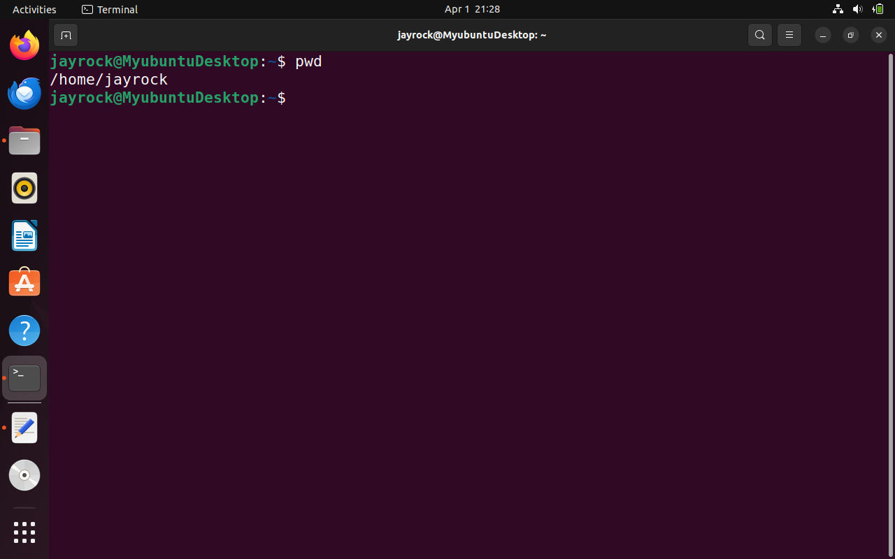
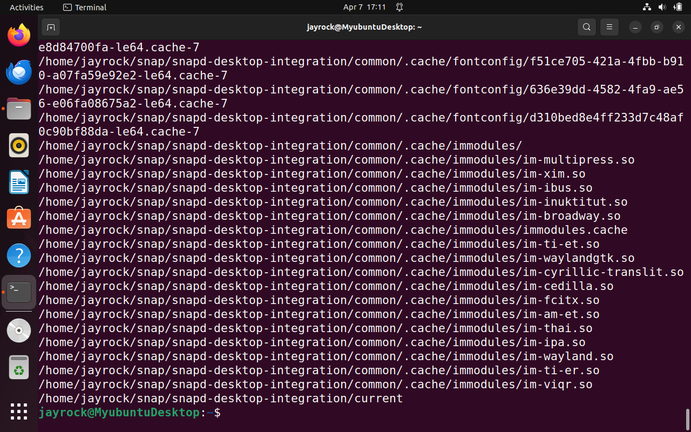

# This is my Linux project

## File Manipulation

### 1. Sudo Command
Sudo is short for superuser do, this is one of the most popular basic Linux commands that lets you perform tasks that require administrative or root permission. 

when using sudo, the system will prompt users to authenticate themselves with a password. Then, the Linux system will log a timestamp as a tracker. By default, every root user can run sudo commands for a 15-minute session. 

If you try to run sudo in the command line without authenticating yourself, the system will log the activity as a security event.

Here is a general syntax:

`sudo (command e.g apt upgrade)`

You can also add options such as:

-k or -reset = timestamp invalidates the timestamp file

-g or -group = group runs command as a specified group name or ID

-h or -host = host runs commands on the host

### 2. Pwd Command: 

Use the pwd command to find the path of your current/present working directory. Simply entering pwd will return the full current path- a path of all the directories that starts with a forward slash(/). For example, /home/ubuntu.

The pwd command uses the following syntax:

`pwd (options)`

It has two acceptable options: 

-L or logical prints environment variable content, including symbolic links.

-P or physical prints the actual path of the current directory.

`pwd`

### 3. cd command:

To navigate through the Linux files and directories, use the cd command. Depending on your current working directory, it requires either the full path or the directory name.

Running this command without an option will take you to the home folder. Keep in mind that only users with sudo privileges can execute it. 

Let's say you're in /home/jayrock and want to go to a new subdirectory of jayrock. To do so, enter the following command:

`cd Documents`

If you want to switch to a completely new directory, for example,/home/jayrock/Documents, you have to enter cd followed by the directory's absolute path:

`cd /home/jayrock/Documents`

Here are some shortcuts to help you navigate:

cd ~[username] goes to another user's home directory.

cd.. moves one directory up

cd- moves to your previous directory.

### 4. ls command:
The ls command lists files and directories within a system. Running it without a flag or parameter will show the current working directory's content.

Here are some options you can use with the ls command:

`ls -R`

lists all the files in the subdirectories

`ls -a`

shows hidden files in addition to the visible ones

`ls -lh`

shows the file sizes in easily readable formats, such as KB, MB, GB, and TB.

### 5. cat command:

Concatenate, or cat is one of the most frequently used Linux commands. It lists, combines, and writes file content to the standard output. To run the cat command, type cat followed by the file name and its extension. For instance:

`cat DevOps`

Here are other ways to use the cat command:

`cat filename1.txt filename2.txt > filename3.txt`

Merges filename1.txt and filename2.txt and stores output in filename3.txt

`tac filename.txt`

displays content in reverse order

### 6. cp command

Use the cp command to copy files or directories and their content. Take a look at the following cases.

To copy one file from the current directory to another, enter cp followed by the file name and the destination directory. For example:

`cp DevOps /home/jayrock/Desktop`

To copy the contents of a file to a new file in the same directory, enter cp followed by the source file and the destination file as shown below:

`cp filename.txt filename2.txt`

To copy an entire directory, pass the -R flag before typing the source directory, followed by the destination directory: 

`cp -R /home/username/Documents /home/username/Documents_backup`

### 7. mv command:

The primary use of the mv command is to move and rename files and directories. Additionally, it doesn't produce an output upon execution.

Simply type mv followed by the filename and destination directory. for example you want to move to the /home/jayrock/Documents directory

`mv DevOps /home/jayrock/Documents`

You can also use mv to rename a file:

`mv DevOps DevOps.txt`

### 8. mkdir command:

Use the mkdir command to create one or multiple directories at once and set permission for each of them. The user executing this command must have the privileges to make a new folder at the parent directory, or they may receive permission denied error/

Here are the basic syntax:

`mkdir {option} directory_name`

For example, you want to create a directory called Blues:

`mkdir Blues`

To create a new directory called Songs inside Blues, use this command

`mkdir Blues/Songs`

The mkdir accepts options such as :

-p or -parent creates a directory between two existing folders. For example,` mkdir -p Music/2020/Songs` will make the new "2020" directory.

To create a directory with fill read, write, and execute permissions for all users, enter mkdir -m777 directory_name.

-v prints a message for each directory created.

### 9. rmdir command

To permanently delete an empty directory, use the rmdir command. Remember that the user running this command should have sudo privileges in the parent directory.

For example, you eant to remove an empty subdirectory names Songs from the Blues folder

`rmdir -p Blues/Songs`

### 10. rm command

The rm command is used to delete files within a directory. Makem sure the user performing this command has the write permissions.

Remember the directory's location as this will remove the file(s) and you can't undo it.

Here is a general syntax

`rm filename`

To remove multiple files enter the following command:

`rm filename1 filename2 filename`

Here are some acceptable options you can add:

-i prompt system confirmation before deleting a file,

-f allows the system to remove without confirmation.

-r deletes files and directories recursively.

### 11. touch command:

The touch command allows you to create and empty file or generate and modify a timestamp in the Linux command line.

For example, enter the following command to create an HTML file named Web in the Documents directory:

`touch web.HTML`

### 12. locate command:

The locate command can find a file in the database system.

Moreover, adding the -i argument will turn off case sensitivity, so you can search for a file even if you don't remember the exact name.

To look for the content that contains two or more words use an asterisk (*). For example:

`locate -i devops`

### 13. find command:

Use the find command to search for files within a specific directory and perform subsequent operations. Here's the general syntax:

`find [option] [path] [expression]`

For example, you want to look for a file called DevOps within the home directory and its subfolders

`find /home -name DevOps`

Here are other variations when using find:

`find -name filename.txt` to find files in the current directory.

`find ./-type d -name` to look for directories.

### 14. grep command:

Another basic Linux command on the list is grep or global regulator expression print. It lets you find a word by searching through all the texts in a specific file. 

once the grep command finds a match, it prints all lines that contain the specific pattern. This command helps filter through large log files.

For example, you want to search for the word head in the DevOps.txt file:

`grep head DevOps.txt`

The command output will display lines that contains head.

### 15. df command:

Use the df command to report the system's disk space usage, shown in percentage and kilobyte (KB). Here's the general syntax: 

`df [options] [file]`

for example, enter the following command if you want to see the current directory's system disc space in human-readable format:

`df -h`

These are some acceptable options to use:

`df -m` displays information on the file system usage in MBs. 

`df -k` displays file system usage in KBs.

`df -T` shows the file system in a new column

### 16. du command:

If you want to check how much space a file or a directory takes up, use the du command to identify which part of the system uses the storage excessively. Remember, you must specify the directory path when using the du command. For example, to check /home/jayrock/DevOps enter:

`du /home/jayrock/DevOps`

Adding a flag to the du command will modify the operation, such as:

-s offers the total size of a specified folder.

-m provides folder and file information in MB.

-k displays information in KB.

-h informs the last modification date of the displayed folders and files.

### 17. head command

The head command allows you to view the first ten lines of a text. Adding an option lets you change the number of lines shown. The head command is also used to output piped data to the CLI.

Here's a general syntax:

`head [option] [title]`

For instance, you want to view the first ten lines of DevOps.txt, located in the current directory:

`head DevOps.txt file`

-n or -lines prints the first customized number of lines. for example, enter head -n5 filename.txt to show the first five lines of the file. 

-c or -bytes prints the first customized number of bytes on each file. 

-q or -quiet will not print headers specifying the file name.

### 18 tail command:

The tail command displays the last ten lines of a file. It allows users to check if a file has new data or to read error messages.

Here's the general format:

`tail [option] [file]`

For example, you want to see the last ten lines of DevOps.txt file:

`tail DevOps.txt `

### 19 diff command:

Short for difference, the diff command compares two contents of a file line by line, After analyzing them, it will display the parts that do not match.

Programmers often use the diff command to alter a program instead of rewriting the entire source code.

Here's the general format:

`diff [option] file1 file2`

For example, you want to compare two files - DepOps and New_Folder

`diff DevOps New_Folder`

Here are some acceptable options to add:

-c displays the difference between two files in a context form.

-u displays the output without redundant information.

-i makes the diff command case insensitive.

### 20. tar command:

The tar command archives multiple files into a TAR file - a common Linux format similar to ZIP, with optional compression.

Here's the basic syntax:

`tar [options] [archive_file] [file or directory to be archived]`

For instance, you want to create a new TAR archive named newarchive.tar in the /home/jayrock directory:

`tar -cvf newarchive.tar /home/jayrock`

The tar command accepts many options, such as:

-x extracts a file.

-t lists the contents of a file.

-u archives and adds to an existing archive file.

## File Permissions and Ownership

### 21. chmod command:

chmod is a common command that modifies a file or directory's read, write, and execute permissions. In Linux, each file is associated with three user classes - owner, group member, and others.

Here's the basic syntax:

`chmod [option] [permission] [file_name]`

For example, the owner is currently the only one with full permissions to change note.txt. To allow group members and others to read, write, and execute the file, change it to the -rwarwxrwo
permission type, whose numeric value is 777:

This command supports many options, including:

`chmod 777 New_Project`

-c or -changes displays information when a change is made. 

-for -silent suppresses the error messages. -v or -verbose displays a diagnostic for each processed file.

### 22. chown command:

The chown command lets you change the ownership of a file, directory, or symbolic link to a specified username.

Here's the basic format:

`chown [option] owner [: group] file(s)`

For example, you want to make linuxuser 2 the owner of filename.txt:

`chown linuxuser2 filename.txt`

### 23. jobs command:

A job is a process that the shell starts. The jobs command will display all the running processes along with their statuses. Remember that this command is only available in esh, bash, tesh, and ksh shells.

This is the basic syntax:

`jobs [options] jobId`

To check the status of jobs in the current shell, simply enter jobs to the CLI.

Here are some options you can use:

-l lists process IDs along with their information.

-n lists jobs whose statuses have changed since the last notification. 

-p lists process IDs only.

### 24. kill command:

Use the kill command to terminate an unresponsive program manually. It will signal misbehaving applications and instruct them to close their processes.

To kill a program, you must know its process identification number (PID). If you don't know the PID, run the following command:

`ps ux`

After knowing what signal to use and the program's PID, enter the following syntax:

`kill [signal option] pid`

There are 64 signals that you can use, but these two are among the most commonly used:

SIGTERM requests a program to stop running and gives it some time to save all of its progress. The system will use this by default if you don't specify the signal when entering the kill command.

SIGKILL forces programs to stop, and you will lose unsaved progress. For example, the program's PID is 63773, and you want to force it to stop:

### 25. ping command:

The ping command is one of the most used basic Linux commands for checking whether a network or a server is reachable. In addition, it is used to troubleshoot various connectivity issues.

Here's the general format:

`ping [option] [hostname_or_IP_address]`

For example, you want to know whether you can connect to Google and measure its response time:

`ping google.com`

This command will ping the address non-stop. To interrupt the pinging press Ctrl + C

### 26. wget command:

The Linux command line lets you download files from the internet using the get command. It works in the background without hindering other running processes.

The wget command retrieves files using HTTP, HTTPS, and FTP protocols. It can perform recursive downloads, which transfer website parts by following directory structures and links, creating local versions of the web pages.

To use it, enter the following command:

`wget [option] [URL]`

For example, enter the following command to download the latest version of WordPress:

`wget https://wordpress.org/latest/zip`

### 27. uname command:

The uname or unix name command will print detailed information about your Linux system and hardware. This includes the machine name, operating system, and kernel. To run this command, simply enter uname into your CLI.

Here's the basic syntax:

`uname [option]`

These are the acceptable options to use:

-a prints all the system information. 

-s prints the kernel name. 

-n prints the system's node hostname.

### 28. top command:

The top command in Linux Terminal will display all the running processes and a dynamic real time view of the current system. It sums up the resource utilization, from CPU to memory usage.

The top command can also help you identify and terminate a process that may use too many system resources.

To run the command, simply enter `top` into the CLI.

### 29. history command:

With history, the system will list up to 500 previously executed commands, allowing you to reuse them without re-entering. Keep in mind that only users with sudo privileges can execute this
command. How this utility runs also depends on which Linux shell you use

To run it, enter the command below:

`history`

This command supports many options, such as:

-c clears the complete history list. 

-d offset deletes the history entry at the OFFSET position. 

-a appends history lines.

### 30. man command:

The man command provides a user manual of any commands or utilities you can run in Terminal, including the name, description, and options.

It consists of nine sections:

Executable programs or shell commands System calls Library calls Games Special files File formats and conventions System administration commands Kernel routines Miscellaneous To display the

For example, you want to access the manual for the Is command:

`man ls`

Enter this command if you want to specify the displayed section:

`man [option) [section number] [command _name]`

For instance, you want to see section 2 of the Is command manual:

`man 2 ls`

### 31. echo command:

The echo command is a built-in utility that displays a line of text or string using the standard output. Here's the basic syntax:

`echo [option] [string]`

`echo Hello`

This command supports many options, such as:

-n displays the output without the trailing newline. 

-e enables the interpretation of the following backslash escapes: 

\a plays sound alert. 

\b removes spaces in between a text,

\c produces no further output. 

-E displays the default option and disables the interpretation of backslash escapes.

### 32. zip, unzip commands:

Use the zip command to compress your files into a ZIP file, a universal format commonly used on Linux. It can automatically choose the best compression ratio.

The zip command is also useful for archiving files and directories and reducing disk usage.

To use it, enter the following syntax:

`zip [options] zipfile filel file2.`

For example, you have a file named DevOps.txt that you want to compress into archive.zip in the current directory:

`zip archive.zip DevOps.txt`

On the other hand, the unzip command extracts the zipped files from an archive. Here's the general format:

`unzip [option] file_name,zip`

So, to unzip a file called archive.zip in the current directory, enter:

`unzip archive.zip`

### 33. hostname command:

Run the hostname command to know the system's hostname. You can execute it with or without an option. Here's the general syntax:

There are many optional flags to use, including:

-a or -alias displays the hostname's alias. 

-A or -all-fqdns displays the machine's Fully Qualified Domain Name (FQDN). 

-i or -ip-address displays the machine's IP address. For example, enter the following command to know your computer's IP address:

### 34. useradd, userdel commands:

Linux is a multi-user system, meaning more than one person can use it simultaneously, useradd is used to create a new account, while the passwd command allows you to add a password. Only those with root privileges or sudo can run the useradd command.

When you use the useradd command, it performs some major changes:

Edits the /etc/passwd, /etc/shadow, /etc/group, and /etc/shadow files for the newly created accounts. Creates and populates a home directory for the user. Sets file permissions and ownerships to the home directory. Here's the basic syntax:

`useradd [option] username`

To set the password:

`passwd the_password_combination`

For example, to add a new person named John, enter the following command simultaneously:

`useradd John`

`passwd 123456789`

To delete a user account, use the userdel command:

`userdel username`

### 35. apt-get command:

apt-get is a command line tool for handling Advanced Package Tool (APT libraries in Linux. It lets you retrieve information and bundles from authenticated sources to manage, update, remove, and
install software and its dependencies.

Running the apt-get command requires you to use sudo or root privileges.

Here's the main syntax:

`apt-get [option] (command)`

These are the most common commands you can add to apt-get:

update synchronizes the package files from their sources. 

upgrade installs the latest version of all installed packages. 

check updates the package cache and checks broken dependencies.

### 36. nano, vi, jed commands:
Linux allows users to edit and manage files via a text editor, such as nano, vi, or jed. nano and vi come with the operating system, while jed has to be installed.

The nano command denotes keywords and can work with most languages. To use it, enter the following command:

`nano DevOps.txt`

vi uses two operating modes to work - insert and command. insert is used to edit and create a text file. On the other hand, the command performs operations, such as saving, opening, copying, and pasting a file.

To use vi on a file, enter:

`vi DevOps.txt`

jed has a drop-down menu interface that allows users to perform actions without entering keyboard combinations or commands. Like vi, it has modes to load modules or plugins to write specific texts.

To open the program, simply enter jed to the command line.

### 37. alias, unalias commands:

alias allows you to create a shortcut with the same functionality as a command, file name, or text. When executed, it instructs the shell to replace one string with another.

To use the alias command, enter this syntax:

For example, you want to make k the alias for the kill command:

On the other hand, the unalias command deletes an existing alias.

Here's what the general syntax looks like:

`unalias [alias_nane]`

### 38. su command:

The switch user or su command allows you to run a program as a different user. It changes the administrative account in the current log-in session. This command is especially beneficial for accessing the system through SSH or using the GUI display manager when the root user is unavailable 

When executed without any option or argument, the su command runs through root privileges. It will prompt you to authenticate and use the sudo privileges temporarily.

Here are some acceptable options to use:

-p or -preserve-environment keeps the same shell environment, consisting HOME, SHELL, USER, and LOGNAME. 

-s or - shell lets you specify a different shell environment to run. 

- or -login runs a login script to switch to a different username. Executing it requires you to enter the user's password.

### 39. htop command:

The htop command is an intense tive program that monitors system resources and server processes in real-time. It is available on most Linux distributions, and you can install it using the default package

Compared to the top command, htop has many improvements and additional features, such as mouse operation and visual indicators.

To use it, run the following command:

`htop`

You can also add options, such as:

-d or -delay shows the delay between updates in tenths of seconds. 

-C or -no-color enables the monochrome mode. 

-h or -help displays the help message and exit.

### 40. ps command:

The process status or ps command produces a snapshot of all running processes in your system. The static results are taken from the virtual files in the /proc file system.

Executing the ps command without an option or argument will list the running processes in the shell along with:

The unique process ID (PID) The type of the terminal (TTY) The running time (TIME) The command that launches the process (CMD)

Here are some acceptable options you can use:

-T displays all processes associated with the current shell session. 
-u username lists processes associated with a specific user.
-A or -e shows all running processes.

