# Setting Up a Basic Load Balancer

Start by provisioning two EC2 instances running Ubuntu 22.04 and installing Apache webserver on both. Then proceed to open port 8000 to allow traffic from anywhere, and finally update the default page of the webservers to display their public IP address.

Next, provision another EC2 instance running Ubuntu 22.04, this time install NGINX and configure it to act as a load balancer distributing traffic across the webservers. 

### Step 1: Provisioning EC2 instances

- Open your AWS Management Console, and click on EC2. Scroll down the page and click on launch instance:

- Under Name, Provide a unique name for each of your webservers: server 1 and server 2

- Under Applications and OS Images, click on Quick Start and click on Ubuntu, then proceed to select Ubuntu Server 22.04 LTS

- Under Key Pair, click on Create a new key pair. You can use the same key pair for all instances in this lesson

- Finally, Click on launch instance

### Step 2: Open port 8000
The webservers will run on port 8000 while the load balancer runs on port 80. Open port 8000 to allow traffic from anywhere. To do this, add a rule to the security group of each of the webservers

- Click on the instance ID to get the details of your EC2 instance,

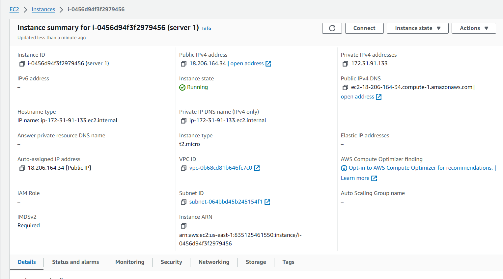

- On the same page, scroll down and click on Security

- Click on Security Group

- Click on Actions and select Edit inbound rules

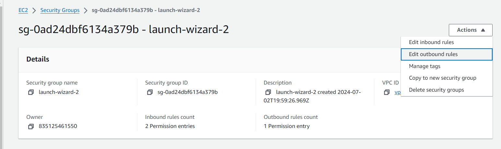

- Add your rules

- Click on Save rules

   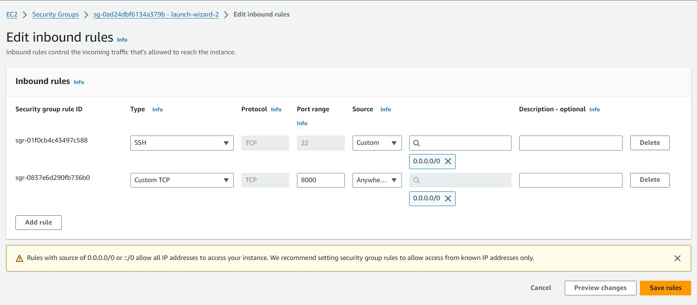

### Step 3: Install Apache Webserver
After provisioning both servers and having opened the necessary ports, It's time to install Apache software on both servers. First, we must connect to each server via ssh. Then we can now run commands on the terminal of our webservers.

- Connecting to the webserver: To connect to the webserver, click on your instance ID and click Connect at the top of the page

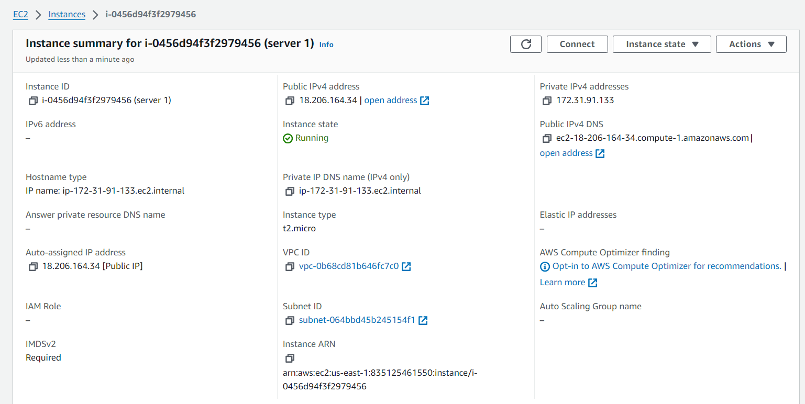

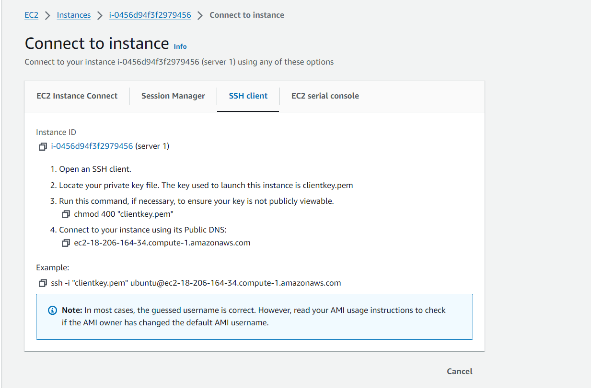

- Copy the ssh command

- Open a terminal on your local machine, cd into the folder containing the key pair, and paste the SSH command

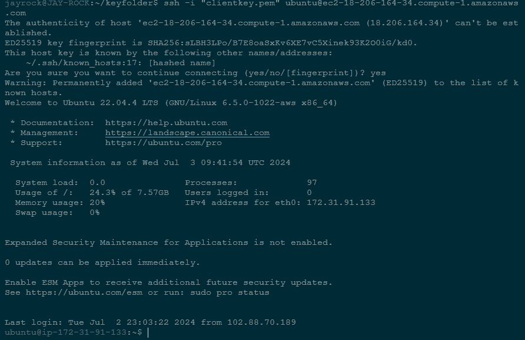

- Click enter and type yes when prompted. You should now be connected to your server.

- Install Apache with the command: `sudo apt update -y && sudo apt install apache2 -y`

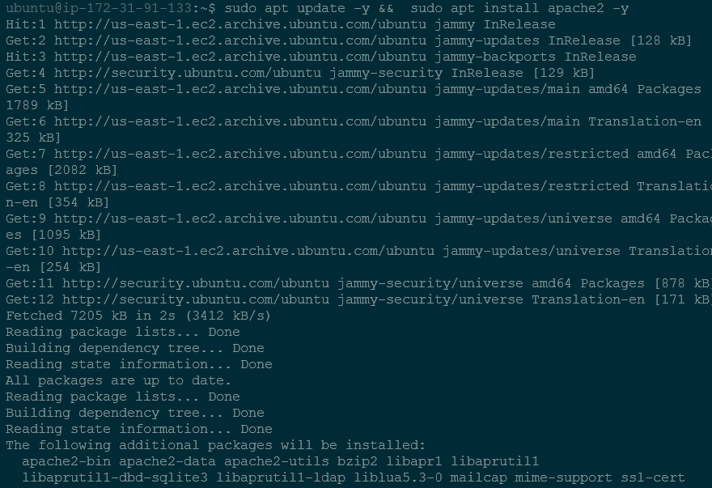

- Verify that Apache is running using the command: `sudo systemctl status apache2`

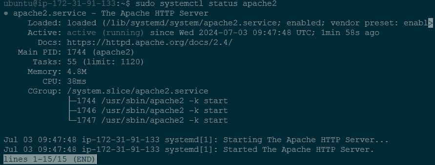

### Step 4: Configure Apache to serve a page showing its public IP:

Start by configuring the Apache webserver to serve content on port 8000 instead of its default which is port 80. Then we will create a new **index.html** file. The file will contain code to display the public IP of the EC2 instance. We will then override Apache webserver's default html file with our new file.

- Configuring Apache to Server content on port 8000:

    1. Using your text editor, open the file /etc/apache2/ports.conf
 
    2. Add a new Listen directive for port 8000: First type I to switch the editor to insert mode. Then add the listen directive. Then save your file
 
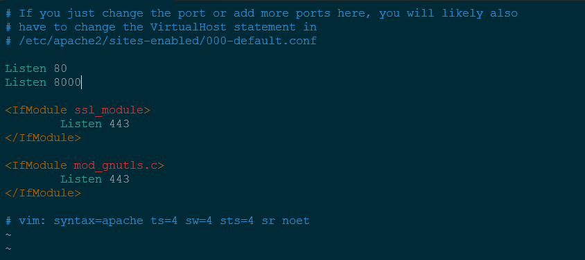
 
    4. Open the file /etc/apache2/sites-available/000-default.cong and change port 80 on the virtual host to 8000

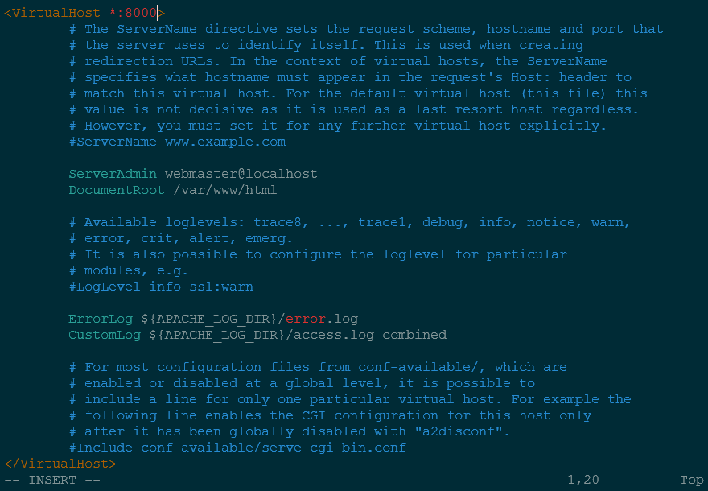
 
    5. Close the file by pressing **esc** key on your keyboard and typing `:wqa!
 
    6. Restart Apache to load the new configuration using the command: `sudo systemctl restart apache2`

- Creating a new HTML file:

    1. Open a new index.html file with the command: `sudo vi index.html`
 
    2. Switch the vi editor to insert mode and paste the html file below. Before pasting the html file, get the public IP of your EC2 instance from AWS Management Console           and replace the placeholder text for IP address in the html file.

```
        <!DOCTYPE html>
        <html>
        <head>
            <title>My EC2 Instance</title>
        </head>
        <body>
            <h1>Welcome to my EC2 instance</h1>
            <p>Public IP: YOUR_PUBLIC_IP</p>
        </body>
        </html>
```

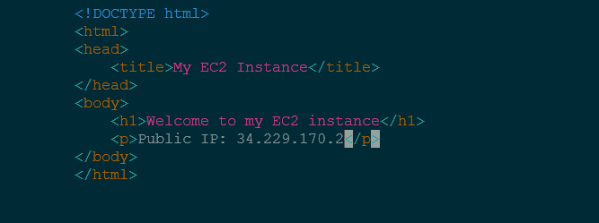

3. Change the file ownership of the **index.html** file with the command: `sudo chown www-data:www-data ./index.html`

- Overriding the Default html file of Apache Webserber
   
    1. Replace the default html file with our new html file using the command: `sudo cp -f ./index.html /var/www/html/index.html`
 
    2. Restart the Webserver to load the new configuration using the command: `sudo systemctl restart apache2`
 
    3. You should have a web page showing:
 
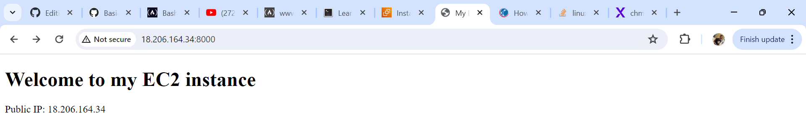
 
### Step 5: Configuring NGINX as a Load Balancer

- Provision a new EC2 instance running on Ubuntu 22.04. Make sure port 80 is opened to accept traffic from anywhere.

- SSH into the instance

- Install Nginx into the instance using the command: `sudo apt update -y && sudo apt install nginx -y`

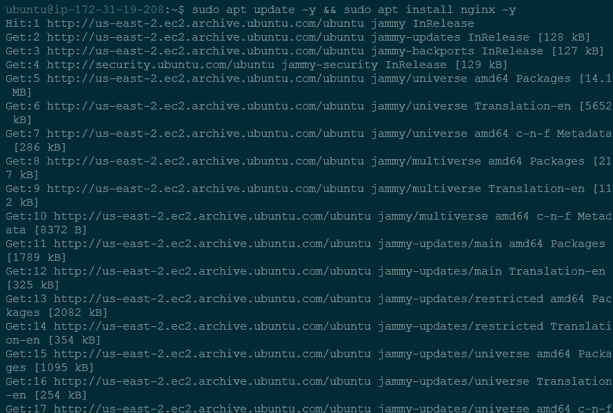

- Verify that Nginx is installed with the command: `sudo systemctl status nginx`

  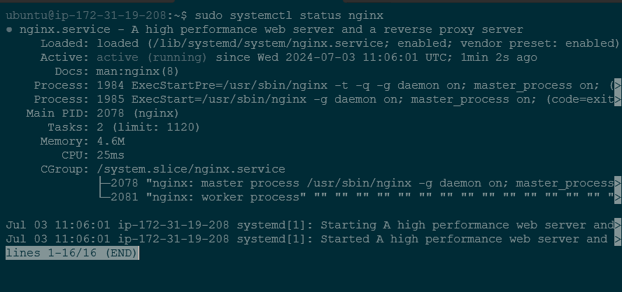

- Open Nginx configuration file with the command: `sudo vi /etc/nginx/conf.d/loadbalancer.conf`

- Paste the configuration file below to configure nginx to act as a load balancer. Ensure to edit the file and provide necessary information like your server IP address

        ```  
        upstream backend_servers {

            # your are to replace the public IP and Port to that of your webservers
            server 127.0.0.1:8000; # public IP and port for webserser 1
            server 127.0.0.1:8000; # public IP and port for webserver 2

        }

        server {
            listen 80;
            server_name <your load balancer's public IP addres>; # provide your load balancers public IP address

            location / {
                proxy_pass http://backend_servers;
                proxy_set_header Host $host;
                proxy_set_header X-Real-IP $remote_addr;
                proxy_set_header X-Forwarded-For $proxy_add_x_forwarded_for;
            }
        }
  ```

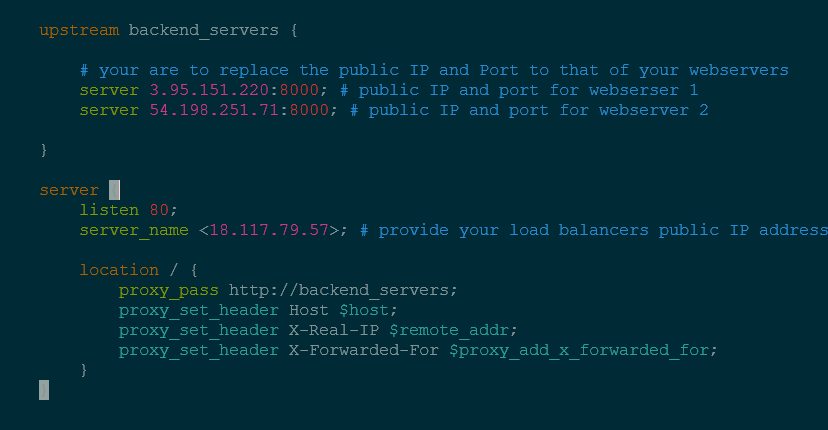

upstream backend_servers defines a group of backend servers. The server lines inside the upstream block list the addresses and ports of your backend servers. Proxy_pass     inside the location block sets up the load balancing, passing the requests to the backend servers. The proxy_set_header lines pass necessary headers to the backend          servers to correctly handle the requests.

- Test your configuration with the command: `sudo nginx -t`

- If there are no errors, restart Nginx to load the new configuration with the command: `sudo systemctl restart nginx`

- Paste the public IP address of Nginx load balancer, you should see the same webpages served by the webservers.


    


    


