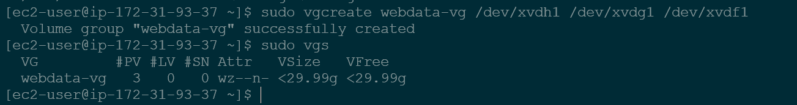
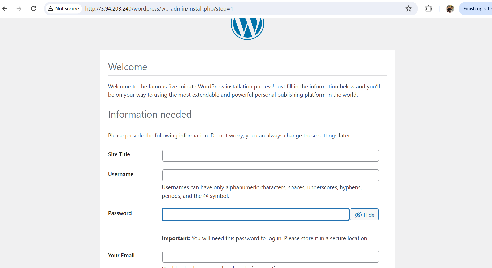

# Implementing LVM on Linux servers (Web and Database servers)

### Step 1: Prepare a Webserver

- Launch an EC2 instance that will serve as a "Web Server". Create 3 volumes in the same Availability zone as your Web Server EC2, 10GiB each.


- Attach all three volumes one after the other to the Webserver EC2 instance


- Open up the Linux terminal to begin configuration

- Use `lsblk` command to inspect what block devices are attached to the server. Notice the names of the newly created devices. All devices in Linux reside in /dev/directory. Inspect it with `ls /dev/` and ensure you see all 3 newly created block devices there.


- Use `df -h` command to see all mounts and free up space on your server


- Use `gdisk` utility to create a single partition on each of the 3 disks

`sudo gdisk /dev/xvdf`

enter n when the command is prompted to create new partition, click enter for all default options and enter w to write new partition when command is prompted again. 


- Use `lsblk` to view the newly configured partitions on each of the 3 disks


- Install `lvm2` package using `sudo yum install lvm2`.


  Run `sudo lvmdiskscan` command to check for available partitions


- Use the command `sudo pvcreate /dev/xvdf1` utility to mark each of the 3 disks as physical volumes PVs to be used by LVM


- Verify that your physical volumes have been created by running `sudo pvs`


- Use the command `sudo vgcreate webdata-vg /dev/xvdg1 /dev/xvdh1 /dev/xvdf1` to add all 3 PVs to a volume group. Name the VG webdata-vg



- Use `lvcreate` utility to create 2 logical volumes. apps-lv (Use half of the PV sixe), and logs-lv Use the remaining space of the PV size. NOTE: apps-lv will be used to store data for the website while, logs-lv will be used to store data for logs.

```
sudo lvcreate -n apps-lv -L 14G webdata-vg
sudo lvcreate -n logs-lv -L 14G webdata-vg
```

- Verify that your Logical volume has been created successfully by running `sudo lvs`


- Verify the entire setup

`sudo vgdisplay -v #view complete setup -VG, PV, and Lv`

`sudo lsblk`


- Use `mkfs.ext4` to format the logical volumes with ext4 filesystem

`sudo mkfs -t ext4 /dev/webdata-vg/apps-lv`

`sudo mkfs -t ext4 /dev/webdata-vg/logs-lv`


- Create /var/www/html directory to store website files

`sudo mkdir -p /var/www/html`

- create /home/recovery/logs

`sudo mkdir -p /home/recovery/logs

- Mount /var/www/html on apps-lv logical volumes

`sudo mount /dev/webdata-vg/apps-lv /var/www/html`

- Use rsync utility to backup all the files in the log directory /var/log into /home/recovery/logs (This is required before mounting the file system)

sudo rsync -av /var/log/. /home/recovery/logs/

- Mount /var/log on logs-lv logical volume. (Note that all existing data on /var/log will be deleted. This is why step 15 is very important)

sudo mount /dev/webdata-vg/logs-lv /var/log

- Update /ect/fstab file so that the mount configuration will persist after restart of the server.

The UUID of the device will be used to update the /etc/fstab file: 

`sudo blkid`


sudo vi /etc/fstab

Update /etc/fstab in this format using your own UUID 

- Test the configuration and reload the daemon

`sudo mount -a`

`sudo systemctl daemon-reload`

- Verify your setup by running `df -h`


# Installing wordpress and configuring to use MySQL Database

### Step 2: Prepare the Database Server

Launch a second RedHat EC2 instance that will have a role - 'DB Server' Repeat the same steps as for the webserver, but instead of apps-lv create dv-lv and mount it to /db directory instead of /var/www/html/ .

### Step 3: Install Wordpress on your Web Server EC2

- Update the repository

`sudo yum -y update`

- Install wget, Apache and it's dependencies

`sudo yum -y install wget httpd php php-mysqlnd php-fpm php-json

- Start Apache

`sudo systemctl enable httpd`

`sudo systemctl start httpd`

- To install PHP and it's dependencies

```
sudo yum install https://dl.fedoraproject.org/pub/epel/epel-release-latest-8.noarch.rpm
sudo yum install yum-utils http://rpms.remirepo.net/enterprise/remi-release-8.rpm
sudo yum module list php
sudo yum module reset php
sudo yum module enable php:remi-7.4
sudo yum install php php-opcache php-gd php-curl php-mysqlnd
sudo systemctl start php-fpm
sudo systemctl enable php-fpm
setsebool -P httpd_execmem 1
```

- Restart Apache

`sudo systemctl restart httpd`

- Download wordpress and copy wordpress to /var/www/html

```
mkdir wordpress
cd   wordpress
sudo wget http://wordpress.org/latest.tar.gz
sudo tar xzvf latest.tar.gz
sudo rm -rf latest.tar.gz
cp wordpress/wp-config-sample.php wordpress/wp-config.php
cp -R wordpress /var/www/html/
```

- Configure SELinux policies

```
 sudo chown -R apache:apache /var/www/html/wordpress
 sudo chcon -t httpd_sys_rw_content_t /var/www/html/wordpress -R
 sudo setsebool -P httpd_can_network_connect=1
```

### Step 4: Install MySQL on your DB Server EC2

`sudo yum update`

`sudo yum install mysql-server`

Verify that the service is up and running by using `sudo systemctl status mysqld`, If it is not running, restart the service and enable it

`sudo systemctl restart mysqld`

`sudo systemctl enable mysqld`

### Step 5: Configure DB to work with WordPress

```
sudo mysql
CREATE DATABASE wordpress;
CREATE USER `myuser`@`<Web-Server-Private-IP-Address>` IDENTIFIED BY 'mypass';
GRANT ALL ON wordpress.* TO 'myuser'@'<Web-Server-Private-IP-Address>';
FLUSH PRIVILEGES;
SHOW DATABASES;
exit
```

### Step 6: Configure Wordpress to connect to remote database

Hint: Do not forget to open MySQL port 3306 on DB Server EC2. For extra security, allow access to DB server only from your Web Server's IP address, so in the Inbound Rule configuration specify source as /32

- Install MySQL client and test that you can connect from your Web server to your DB server by using mysql-client

`sudo yum install mysql`

`sudo mysql -u admin -p -h <DB-server-private-IP-address>`

- Verify if you can successfully execute SHOW DATABASES; command and see a list of existing databases.


- edit /var/www/html/wp-config.php directory to connect to database:


- Enable TCP port 80 in Inbound Rules configuration for your Web server EC2 (enable from everywhere 0.0.0.0/0 or from your workstation's IP)

- Try to access from your browser the link to your Wordpress HTTP://<Web-Server-Public-IP-address>/wordpress/



Fill out your DB credentials:


